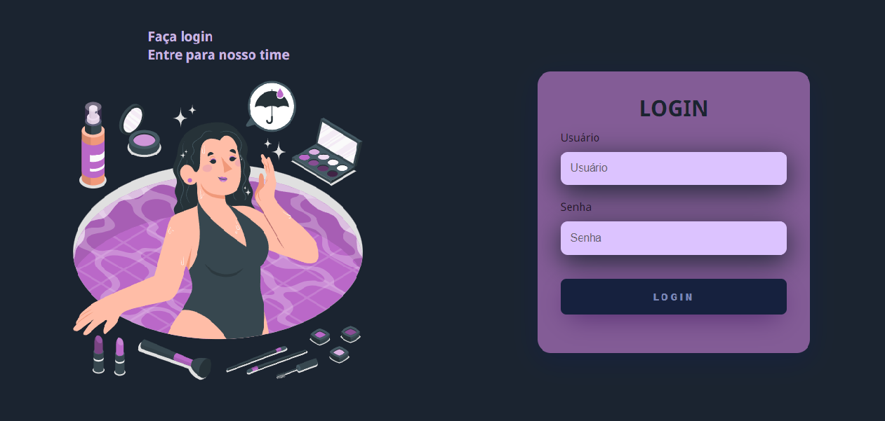

Login Page

Este repositório contém o código e os recursos necessários para implementar uma página de login responsiva e elegante. A página de login é crucial para aplicativos da web, permitindo que os usuários acessem suas contas com segurança.

Recursos

* HTML5 e CSS3 para a estrutura e estilo da página de login.
* Design responsivo para adaptar-se a diferentes dispositivos.
* Layout intuitivo para uma experiência agradável.
* Personalizável para atender às necessidades do projeto.
* 
Como usar

1. Faça o download ou clone o repositório.
2. Abra o arquivo index.html no seu editor de código.
3. Personalize o formulário de login conforme necessário.
4. Adicione validação aos campos para garantir a segurança dos dados.
5. Inclua links e recursos para autenticação do usuário.
6. Teste a página de login em dispositivos e navegadores diferentes.
7. Implante a página de login em sua plataforma preferida.
 
Exemplo

Visualização da página de login

Contribuição

Contribuições são bem-vindas! Abra uma issue ou envie uma solicitação de pull request.

Licença

Licenciado sob a Licença MIT.

Esperamos que esta página de login seja útil para o seu projeto!
